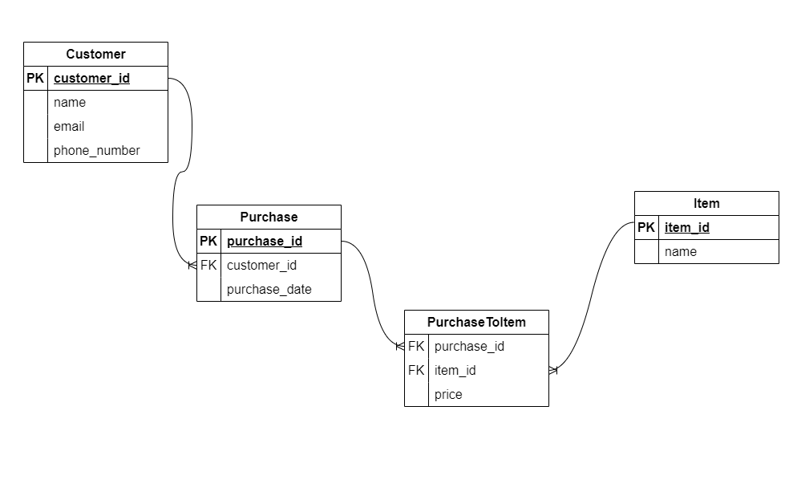

# Tinkoff analytics test case: сервис на FastApi для записи информации о покупках по партнерской акции

## Что мы хотим хранить в БД?
### 1. Список пользователей с личной информацией, email и телефоном 
- #### Возможные проблемы:
    - **Разделение профилей пользователей.** \
    По тех. заданию непонятно, как происходит система логина у партнера. Если телефон и email вводятся не при входе в аккаунт, а при каждой новой покупке, один и тот же юзер при двух разных покупках может указать разный email и/или телефон. \
    Если в таком случае мы определяем юзера только по ФИО, мы можем случайно объединить полных однофамильцев в один аккаунт. \
    Если же определяем по всем трем полям: ФИО, телефон и email, тогда разделить один профиль на 2 записи. \
    **Оптимальным решением данной проблемы видится идентификация пользователя по одной из комбинаций ФИО + email или ФИО + телефон:** 
        - Если хотя бы одна совпадает -> тот же человек, в профиле которого при необходимости меняем телефон/email
        - Если не совпадает -> другой. 
        - ФИО стоит учитывать в любом случае, потому что есть возможность (опять же, потому что точной информации о системе ритейлера нет), что, например, два члена семьи могут регистрироваться или оформлять покупки по одному email. 
    - **Разный формат номера телефона.** \
    Необходимо приводить, например, 2 следующих номера: *+7(123)456-78-90* и *81234567890* к единому виду. Я решила приводить к виду *+71234567890* \
    К тому же, по тз непонятно, в каких странах работает партнер, но будем предполагать, что только в России.
### 2. Список товаров и цены на них
 - #### Возможные проблемы:
    - За время акции цена на товар у партнера может поменяться. \
    Поэтому один и тот же товар в разных чеках может иметь разную цену, и, если мы просто запишем цену в таблицу с товарами, мы не всегда сможем верно восстановить цену этого товара в конкретном чеке. \
    Чтобы решить эту проблему, можно:
        - **Создать таблицу с историей цен на товары.** Но у этого решения может быть проблема, если партнерскую акцию можно комбинировать с какими-либо персональными акциями.
        - **Хранить цену товара в таблице связей покупка-товар.** У этого решения явных проблем, кроме потенциального дублирования информации, нет.
### 3. Список покупок
Вопрос на подумать, ответ на который невозможно установить по ТЗ: \
надо ли хранить в этой таблице общую сумму каждой покупки. \
Если эта информация часто будет нужна, лучше ее хранить. \
Но, вообще, в нашей ситуации она будет дублирующей и ее можно будет восстановить, поэтому я в решении хранить общую сумму не стала.
### 4. Таблица связей покупка-товар ( с ценой в конкретном чеке)

## Схема БД


## Запуск сервиса

### 1. Клонируете этот репозиторий

### 2. Находите файлик **ENV.settings** и копируете его содержимое в созданный локально файлик .env

### 3. Создаете виртуальное окружение:
```bash
python -m venv venv
```

### 4. Устанавливаете зависимости:
```bash
pip install -r requirements.txt
```

### 5. Старт сервера:
```bash
python manage.py
```
